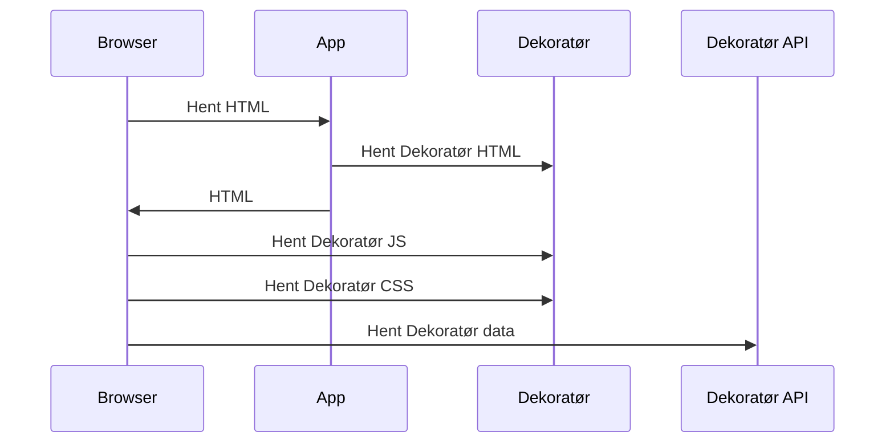
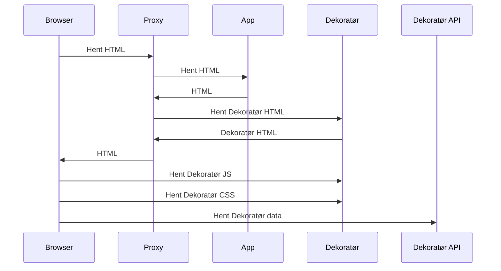

# ADR 001 - Oppdatert Dekoratør

## Beskrivelse

Dekoratøren er et sett med side-komponenter som brukes for å bygge opp en felles visuell profil for NAV sine tjenester. Den inneholder blant annet header, footer og navigasjonsmeny.

I dag er det to måter å laste inn dekoratøren på:

* client-side rendering (CSR)
* server-side rendering (SSR)

For server-side rendering ser det slik ut:

### Utfordringer

Den største utfordringen går på at det er ikke alltid at brukeren får se siste versjon av dekoratøren og at det kan være avhengig av når applikasjonen ble bygget eller når siden ble cachet. For å løse dette har dekoratøren en innebygget re-hydration som sjekker om det finnes en nyere versjon av dekoratøren og laster denne inn. Dette gjør at brukeren kan få en litt forsinket oppdatering av dekoratøren (hvit skjerm).

## Løsningsforslag

### Server Side Inclusion (SSI)

SSI er en teknikk som lar deg inkludere innhold fra en annen kilde i en HTML fil. Denne teknikken er støttet av de fleste webservere og er en enkel måte å inkludere innhold fra en annen kilde i en HTML fil. Denne teknikken er også støttet av de fleste webservere og er en enkel måte å inkludere innhold fra en annen kilde i en HTML fil.

