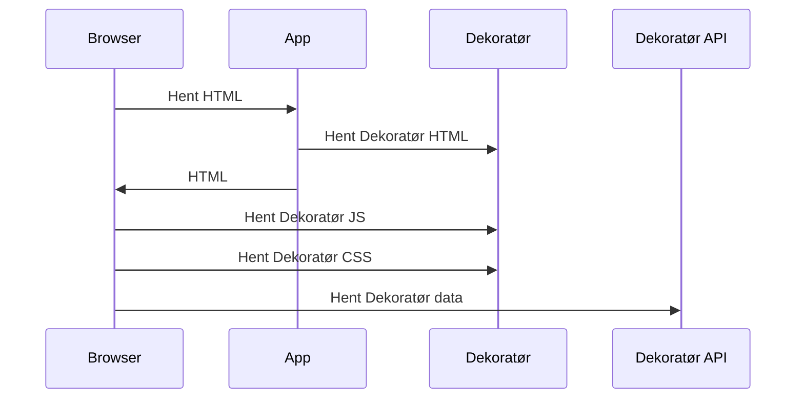
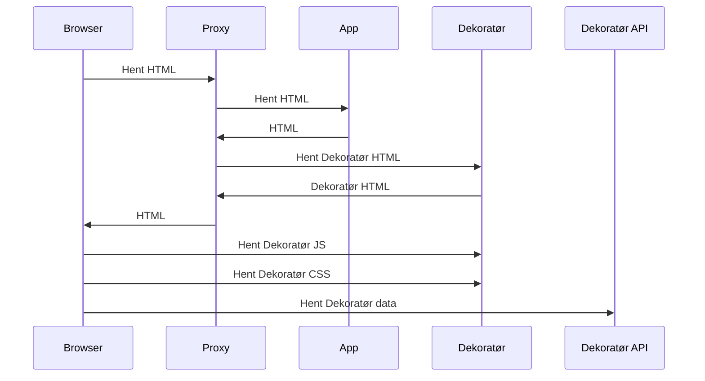

# ADR 001 - Oppdatert Dekoratør

## Beskrivelse

NAV benytter seg av en mikro-frontend arkitetur for å bygge opp sine tjenester. Dette betyr at tjenestene er bygget opp av flere mindre tjenester som er koblet sammen. En av disse tjenestene er dekoratøren som er en felles komponent som brukes for å bygge opp en felles visuell profil for NAV sine tjenester. Den inneholder blant annet header, footer og navigasjonsmeny.

I dag er det to måter å laste inn dekoratøren på:

* client-side rendering (CSR)
* server-side rendering (SSR)

For server-side rendering ser det slik ut:

### Utfordringer

#### Gammel versjon av dekoratøren

Den største utfordringen går på at det er ikke alltid at brukeren får se siste versjon av dekoratøren og at det kan være avhengig av når applikasjonen ble bygget eller når siden ble cachet. For å løse dette har dekoratøren en innebygget re-hydration som sjekker om det finnes en nyere versjon av dekoratøren og laster denne inn. Dette gjør at brukeren kan få en litt forsinket oppdatering av dekoratøren (hvit skjerm).

#### Layout shift

Når dekoratøren lastes inn på client-side så vil den ikke være synlig før den er ferdig lastet og populert med data. Dette kan føre til at innholdet på siden flytter seg når dekoratøren lastes inn. Dette kan føre til at brukeren får en dårlig opplevelse.

## Løsningsforslag

### Server Side Inclusion (SSI)

SSI er en teknikk som lar deg inkludere innhold fra en annen kilde i en HTML fil. Denne teknikken er støttet av de fleste webservere og er en enkel måte å inkludere innhold fra en annen kilde i en HTML fil. Denne teknikken er også støttet av de fleste webservere og er en enkel måte å inkludere innhold fra en annen kilde i en HTML fil.

#### Fordeler

* Enkel implementering

#### Ulemper

* Caching?

### Podium

Podium er en Node.js bibliotek som lar deg bygge opp en mikro-frontend arkitetur. Biblioteket har innebygget støtte for server-side rendering og client-side rendering.

* https://podium-lib.io/

### Luigi Project

* https://luigi-project.io/

### Piral

* https://piral.io/

## Literatur

* https://en.wikipedia.org/wiki/Server_Side_Includes
* https://livebook.manning.com/book/micro-frontends-in-action
* https://blog.davidfuhr.de/2020/06/12/composing-micro-frontends-server-side.html
* https://ruben-rodriguez.github.io/posts/ingress-nginx-server-side-includes/
* https://engineering.zalando.com/posts/2021/09/micro-frontends-part2.html
* https://micro-frontends.org/