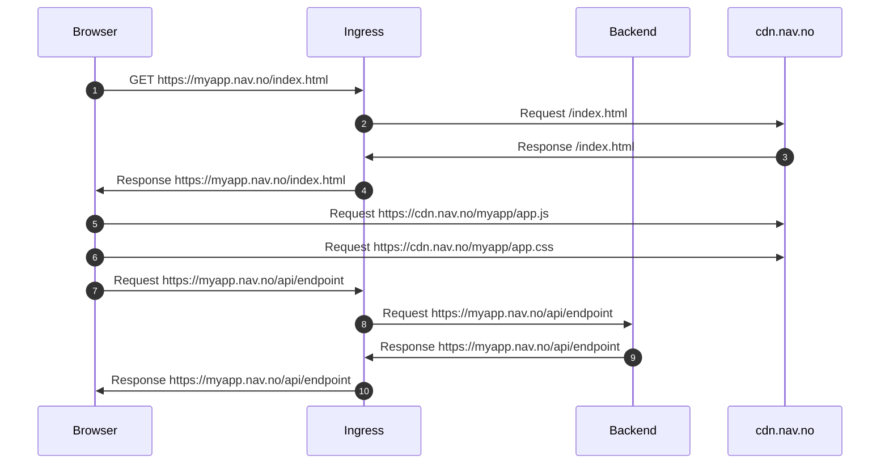

# Deploye React SPA til NAV CDN

- [Deploye React SPA til NAV CDN](#deploye-react-spa-til-nav-cdn)
  - [Innledning](#innledning)
  - [Forutsetninger](#forutsetninger)
  - [Lag en React App](#lag-en-react-app)

## Innledning

Denne guiden beskriver hvordan du kan bygge og deploye en React SPA med en enkel backend til NAIS og NAV CDN.

Nedenfor ser du et sekvensdiagram som viser hvordan en bruker navigerer til en React SPA som er deployet til NAV CDN og hvilke steg som skjer underveis.



Sekvensdiagrammet viser interaksjonen mellom fire objekter eller komponenter: Nettleser (Browser), Ingress, Backend og NAV CDN. Diagrammet viser flyten av meldinger eller hendelser mellom disse komponentene når de kommuniserer med hverandre.

Sekvensen begynner med at nettleseren sender en forespørsel om filen `/index.html` til Ingress `(1)`. Ingress sender så en forespørsel om samme fil til NAV CDN. NAV CDN svarer på forespørselen ved å sende den forespurte filen tilbake til Ingress, som igjen sender den tilbake til nettleseren.

Videre sender nettleseren forespørsler om filene `/app.js` og `/app.css` direkte til NAV CDN og ikke via Ingress i `(5)` og `(6)`.

Til slutt sender nettleseren en forespørsel til API-endepunktet `/api/endpoint` til Ingress. Ingress videresender denne forespørselen til Backend som svarer på forespørselen.

## Forutsetninger

For å kunne deploye en React SPA til NAV CDN må du ha følgende på plass:

- Et område i NAV CDN (se [nais/frontend-plattform](https://github.com/nais/frontend-plattform))
- En NAIS API-nøkkel

## Lag en React App

Begynn med å lage et nytt git repo:

```bash
git init myapp
```

Lag en ny mappe `frontend` og inni denne kjør følgende kommando:

```bash
npx create-react-app myapp
```

Du kan bytte ut `myapp` med det navnet du ønsker at applikasjonen din skal hete.

Lag en GitHub actions workflow i `.github/workflows/frontend.yaml` med følgende:

```yaml
name: "Frontend"

on:
  push:
    branches:
      - 'main'
    paths:
      - 'frontend/**'
      - '.github/workflows/frontend.yaml'
  pull_request:
    paths:
      - 'frontend/**'
      - '.github/workflows/frontend.yaml'

jobs:
  build-and-deploy:
    runs-on: ubuntu-latest

    permissions:
      contents: 'read'
      id-token: 'write'

    defaults:
      run:
        working-directory: frontend

    steps:
      - uses: actions/checkout@v3
      - uses: actions/setup-node@v3
        with:
          node-version: 18.x
      - run: npm ci
      - run: npm run lint
      - run: npm run build

      - uses: navikt/frontend/actions/spa-deploy/v1@main
        # if: github.ref == 'refs/heads/main'
        with:
          app-name: myapp
          team-name: myteam
          environment: labs
          ingress: https://myteam-myapp.labs.nais.io/
          source: frontend/build
          nais-deploy-apikey: ${{ secrets.NAIS_DEPLOY_APIKEY }}
```
